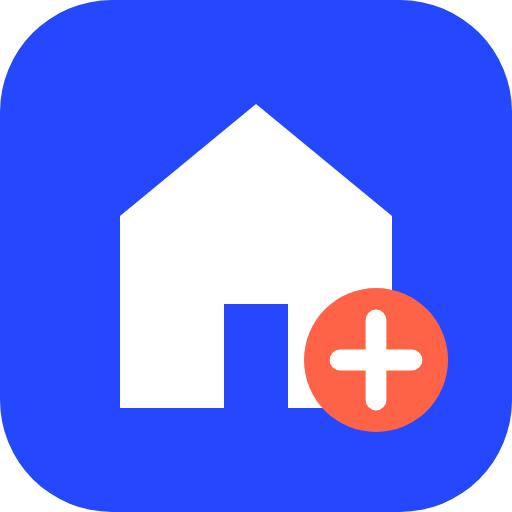

<div align="center">



# Trouver mon EHPAD

**Le reste à charge réel en EHPAD, établissement par établissement, aides déduites.**<br>
Comparateur indépendant, gratuit, sans inscription et sans démarchage commercial.

[](https://trouver-mon-ehpad.fr/)
[](https://www.data.gouv.fr/reuses/trouver-mon-ehpad-calculateur-du-reste-a-charge-net-aides-apa-apl-2026)
[](https://fr.trustpilot.com/review/trouver-mon-ehpad.fr)
[](https://github.com/Akh793/trouver-mon-ehpad.fr/actions/workflows/pages.yml)
[](https://github.com/Akh793/trouver-mon-ehpad.fr/commits/main)


[**Ouvrir le calculateur →**](https://trouver-mon-ehpad.fr/)

</div>

---

## En bref

Le prix affiché par un EHPAD n'est pas ce que la famille paie. **Trouver mon EHPAD** part du code
postal, des ressources du résident et de son niveau d'autonomie, et calcule pour chaque
établissement de la zone **ce qui resterait réellement à payer chaque mois** :

- **tarif d'hébergement et tarif dépendance** déclarés par l'établissement ;
- **moins l'APA en établissement**, calculée selon le barème national ;
- **moins l'aide au logement** déjà notifiée (montant saisi par l'utilisateur : le site ne la simule pas) ;
- avec, à part, la **réduction d'impôt** et le scénario **aide sociale à l'hébergement**.

| | |
|---|---|
| **0 €** | Entièrement gratuit, sans publicité ni établissement partenaire. |
| **0 inscription** | Aucun compte. Les informations saisies restent dans le navigateur et ne sont jamais transmises. |
| **0 démarchage** | Aucun formulaire de contact revendu, aucun rappel commercial. |

**En chiffres :** 7 415 EHPAD · environ 7 900 pages (régions, départements, villes, établissements, guides) ·
historique des prix depuis 2018.

## Fonctionnalités

- **Calculateur de reste à charge** : carte interactive, tri par reste à charge, par distance ou par prix, filtres (aide sociale, unité Alzheimer, accueil temporaire…).
- **Fiche par établissement** : tarifs, évolution depuis 2018, habilitation à l'aide sociale, évaluation de la Haute Autorité de santé, unités spécialisées, contrôles publiés par l'ARS.
- **Pages territoriales** : prix médians, comparaison entre communes, population âgée de 75 ans et plus (INSEE).
- **Guides et lexique** : APA, aide sociale à l'hébergement, GIR, contrat de séjour, dossier d'admission…
- **Mode professionnel** pour les travailleurs sociaux : liste de démarches, export CSV.

## Sources de données publiques

| Source | Producteur | Utilisation |
|---|---|---|
| Prix hébergement et tarifs dépendance des EHPAD | **CNSA** — Caisse nationale de solidarité pour l'autonomie | Tarifs déclarés, historique 2018-2025 |
| **FINESS** / FINESS+ (Structures et Activités) | Agence du numérique en santé | Identité, adresse, habilitation à l'aide sociale, places installées, unités Alzheimer |
| Résultats d'évaluation des ESSMS | Haute Autorité de santé | Note A à D, critères impératifs |
| Alim'confiance | Direction générale de l'alimentation | Contrôles d'hygiène |
| Badiane, enquête EHPA, modalités de l'ASH | DREES | Contexte départemental |
| Recensement de la population 2023, grille de densité | INSEE | Population âgée, typologie des communes |
| Plan de contrôle des EHPAD 2022-2024 | ARS | Liens vers les documents publiés |
| Barème APA | OpenFisca-France, Service-public.fr | Calcul des aides |
| BD ORTHO, Géoplateforme | IGN | Fond de carte, vues aériennes |
| Photos libres | Wikimedia Commons, Panoramax | Vignettes des établissements |

Le détail des jeux de données, de leurs licences et de la procédure de mise à jour est dans
[`MAINTENANCE.md`](MAINTENANCE.md). La méthode de calcul est publiée sur
[la page Méthodologie](https://trouver-mon-ehpad.fr/notre-methodologie.html).

## Architecture technique

Site **100 % statique**, sans base de données ni serveur applicatif :

```
site/            ce qui est mis en ligne (GitHub Pages) — HTML, CSS, JavaScript sans framework
build/           scripts Python qui fabriquent site/ à partir des données publiques
worker-mesure/   compteur d'audience sans cookie (Cloudflare Worker + D1)
worker/          réception des retours des visiteurs (Cloudflare Worker)
```

- **Calcul côté navigateur** : le moteur de reste à charge est en JavaScript (`site/app.js`) ; les données sont découpées par département et chargées à la demande.
- **Génération statique** : les pages territoriales et les fiches sont produites par `build/seo/build_seo.py`.
- **Carte** : Leaflet, fond de plan IGN.
- **Déploiement** : GitHub Actions publie le dossier `site/` sur GitHub Pages à chaque push sur `main`.
- **Aucune IA** dans le fonctionnement du site : les calculs sont déterministes et reproductibles.

### Reconstruire le site

Les données sources téléchargées (plusieurs centaines de Mo) ne sont pas versionnées : elles se
retéléchargent en suivant `MAINTENANCE.md`.

```bash
cd build
python3 build_data_v2.py     # croise les sources        → merged_v2.json
python3 split_data_v2.py     # découpe par département   → ../site/data/**
python3 build_site.py        # calculateur               → ../site/index.html
python3 build_pages.py       # pages annexes
python3 seo/build_seo.py     # pages de contenu + sitemaps
```

Voir le site en local :

```bash
cd site && python3 -m http.server 8000
```

## Écosystème

| | |
|---|---|
| 🌐 **Site officiel** | [trouver-mon-ehpad.fr](https://trouver-mon-ehpad.fr/) |
| 🇫🇷 **Réutilisation data.gouv.fr** | [Fiche de réutilisation](https://www.data.gouv.fr/reuses/trouver-mon-ehpad-calculateur-du-reste-a-charge-net-aides-apa-apl-2026) |
| ⭐ **Avis** | [Trustpilot](https://fr.trustpilot.com/review/trouver-mon-ehpad.fr) |
| 💼 **LinkedIn** | [Trouver mon EHPAD](https://www.linkedin.com/company/trouver-mon-ehpad/) |
| 📘 **Facebook** | [Page Facebook](https://www.facebook.com/profile.php?id=61595177609655) |
| ✍️ **Article** | [Comment l'open data permet enfin de calculer le vrai prix des EHPAD](https://medium.com/@david_10466/comment-lopen-data-permet-enfin-de-calculer-le-vrai-prix-des-ehpad-et-d-%C3%A9viter-le-harc%C3%A8lement-abaa01c70753) (Medium) |
| 💬 **Quora** | [Quel est le prix moyen d'une place en EHPAD ?](https://fr.quora.com/Quel-est-le-prix-moyen-dune-place-en-epad-pour-un-Monsieur-de-88-ans-exemple-ostentatoire-344-euros-par-mois/answer/David-Rival-2) |
| 🗨️ **Reddit** | [Qu'est-ce qui explique le prix des EHPAD ?](https://www.reddit.com/r/PasDeQuestionIdiote/comments/1wg0txp/questce_qui_explique_le_prix_des_ehpad/) |

## Avertissement

Les montants affichés sont des **estimations** calculées à partir de données publiques et de règles
nationales. Ils ne constituent ni un devis, ni une décision d'aide, ni un conseil juridique ou
fiscal. Le montant réel dépend de l'évaluation du niveau d'autonomie, des décisions du département
et du contrat de séjour signé avec l'établissement.

## Contact

Une erreur, une donnée qui a changé ? Écrivez à
[contact@trouver-mon-ehpad.fr](mailto:contact@trouver-mon-ehpad.fr) avec le numéro FINESS de
l'établissement.

Projet édité par [David Rival](https://trouver-mon-ehpad.fr/qui-sommes-nous.html).
